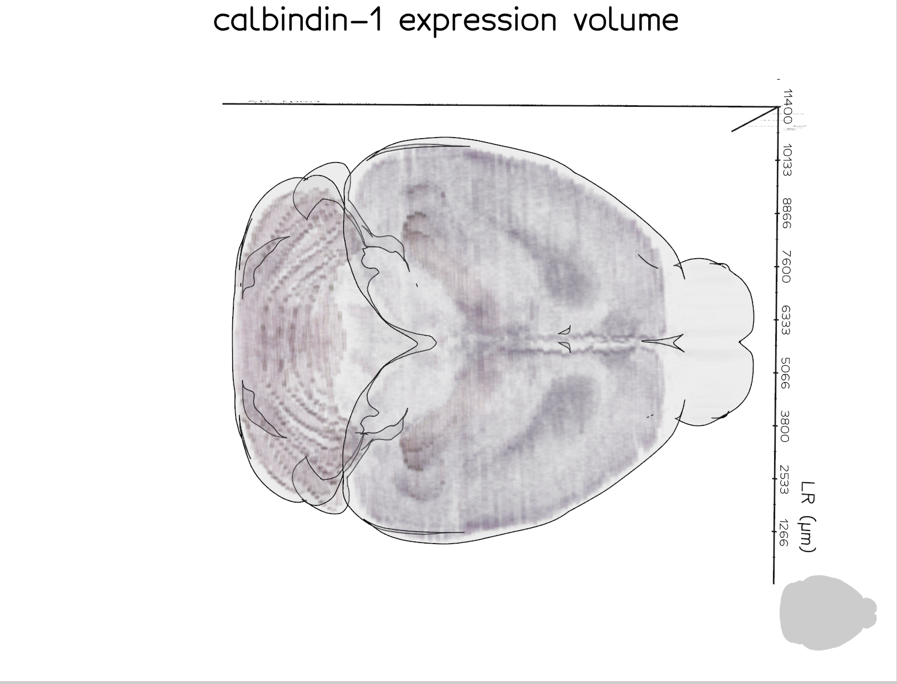
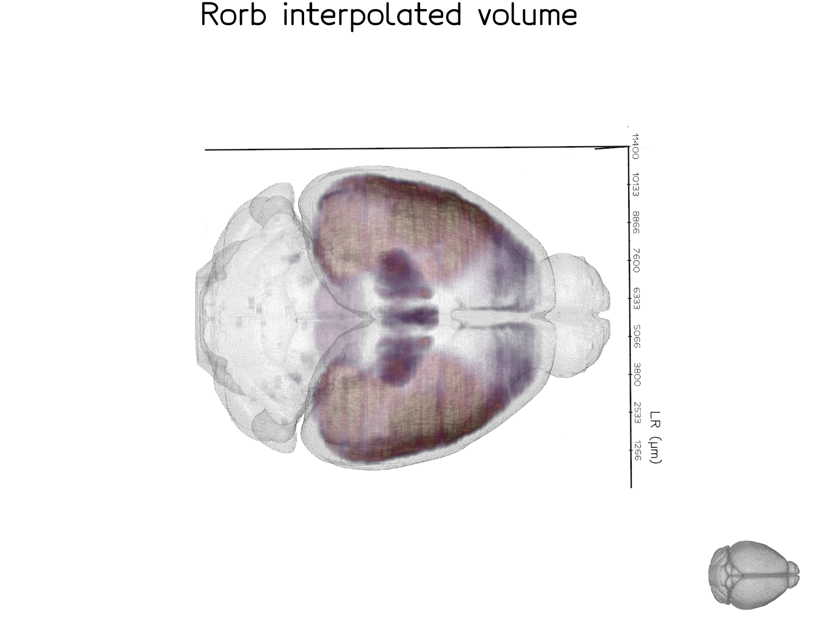

# Visualising  PyNutil volumes in brainrender

Render a PyNutil interpolated expression volume as a semi-transparent 3D heatmap
in [brainrender](https://brainrender.readthedocs.io), with no intermediate files
written to disk.

The example below uses a single calbindin-1 ISH section series registered with
section-to-volume alignment only.



A more fully-powered example is the Rorb dataset below, which combines **26
section series** and **nonlinear (ANTS) registration** to produce a
smoother, more complete volume.  This dataset is from the study available at
<https://doi.org/10.64898/2026.01.20.700446>.



## Code

```python
import numpy as np
from brainglobe_atlasapi import BrainGlobeAtlas
from brainrender import Scene, settings
from brainrender.actors import Volume

import PyNutil as pnt

settings.SHADER_STYLE = "default"

IMAGE_DIR = "path/to/expression_25um"
ALIGNMENT_JSON = "path/to/alignment.json"

atlas = BrainGlobeAtlas("allen_mouse_25um")
alignment = pnt.read_alignment(ALIGNMENT_JSON)

image_series = pnt.read_image_dir(IMAGE_DIR)

result = pnt.interpolate_volume(
    image_series=image_series,
    registration=alignment,
    atlas=atlas,
    value_mode="mean",
    segmentation_mode=False,
    intensity_channel="grayscale",
    do_interpolation=True,
    return_orientation="rsa",   # required for brainrender axis convention
)

arr = result.value.astype(np.float32)
arr = np.nan_to_num(arr, nan=0.0)

vmax = float(arr.max())

scene = Scene(atlas_name="allen_mouse_25um", title="expression volume")

volume = Volume(
    arr,
    voxel_size=25,
    cmap="magma",
    as_surface=False,
)

volume.mesh.alpha([
    (0,           0.0),
    (1,           0.0),
    (vmax * 0.2,  0.10),
    (vmax * 0.5,  0.2),
    (vmax * 0.8,  0.4),
    (vmax,        0.6),
])
volume.mesh.cmap("magma", vmin=0, vmax=vmax * 0.6)
volume.mesh.alpha_unit(300)
volume.mesh.mode(0)

scene.add(volume)
scene.render()
```
